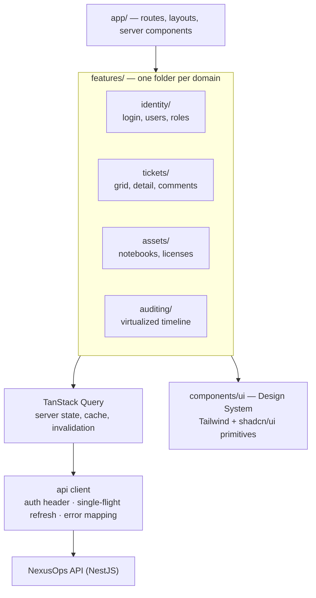

<h1 align="center">NexusOps — Frontend</h1>

<p align="center">
  <strong>The B2B multi-tenant SaaS interface for corporate helpdesk, asset control and auditing.</strong><br>
  Built around the guarantees the API already enforces — tenant isolation, optimistic concurrency,
  async work, audit trails — instead of re-inventing them in the browser.
</p>

<p align="center">
  <a href="./LICENSE"></a>
  <a href="https://github.com/brunocbarbosa/NexusOps_backend"></a>
</p>

<!--
  CI badges go here once the pipeline exists — keep them commented until the workflows are real,
  a badge pointing at a missing workflow renders as "invalid" and reads worse than no badge.
  <a href="https://github.com/brunocbarbosa/NexusOps_frontend/actions/workflows/ci.yml"></a>
  <a href="https://sonarcloud.io/summary/new_code?id=brunocbarbosa_NexusOps_frontend"></a>
-->

<p align="center">
  
  
  
  
  
  
  
</p>

---

## Why this project exists

Most portfolio frontends demonstrate that the author can fetch a list and render it. This one starts
from a different question: **what does a UI owe to a backend that already refuses to fail silently?**

The [NexusOps API](https://github.com/brunocbarbosa/NexusOps_backend) makes deliberate choices that a
careless client throws away. It answers `404` and never `403` for another tenant's resource, so the
existence of that resource is never confirmed. It answers the same `401` — in the same amount of
time — for a wrong password and a nonexistent account. It answers `409 Conflict` instead of
overwriting a colleague's edit, and `202 Accepted` instead of blocking on a report. Rendering
"something went wrong" over all of that discards work that was done on purpose.

So the guiding rule here is the mirror image of the backend's: **cross-cutting concerns get one
place to live, not a convention repeated in every screen.** One HTTP client that carries auth and
refresh, one error mapping that turns status codes into user-visible outcomes, one cache that owns
server state. A screen that has to remember to handle `409` is a screen that eventually will not.

---

## Project status

An in-progress portfolio project, and this table says exactly where it stands.

| Area                                            | Status         | Notes                                                                |
| ----------------------------------------------- | -------------- | -------------------------------------------------------------------- |
| Architecture & contract documentation           | ✅ Implemented | `documents/`, plus the backend's measured behaviour mirrored in-repo |
| Working agreements for AI agents (`CLAUDE.md`)  | ✅ Implemented | Stack, feature layout, and the API contract that shapes the screens  |
| Next.js scaffold — TypeScript, App Router       | 🚧 Planned     | Nothing in `src/` yet; the repository is documentation only          |
| Design System — Tailwind + shadcn/ui            | 🚧 Planned     | Tokens, primitives, and the app shell                                |
| Auth — login with `tenantDomain`, refresh flow  | 🚧 Planned     | Single-flight refresh is a hard requirement, see below               |
| Helpdesk — ticket grid and detail               | 🚧 Planned     | TanStack Table + the `409 Conflict` reconciliation flow              |
| Audit timeline — virtualized                    | 🚧 Planned     | `@tanstack/react-virtual`, tens of thousands of rows                 |
| Async reports — `202` + SSE/WebSocket           | 🚧 Planned     | Depends on the backend's queue module, itself planned                |
| Test tiers — Jest + RTL, Playwright             | 🚧 Planned     | Commands below are the intended scripts, not yet runnable            |
| CI/CD — Husky, Commitlint, SonarCloud           | 🚧 Planned     | Mirrors the backend pipeline                                         |

---

## Architecture

### Organization by feature, mirroring the API's domains

The backend separates its business domains into isolated NestJS modules — `identity`, `helpdesk`,
`auditing`. The frontend mirrors that split instead of grouping files by type.



Everything a domain owns — components, hooks, query options, types, schemas — lives in
`features/<domain>/`. Changing how a ticket renders means opening `features/tickets/`, and nothing
else. What sits in `components/ui/` is there because more than one domain uses it, not because it
accumulated there; a complex domain-specific piece like the audit timeline stays in its feature.

### Server state is not application state

TanStack Query owns everything that came from the API: cache, loading and error states,
invalidation, retries. Copying a response into `useState` or a global store creates a second source
of truth that goes stale without telling anyone. Client state — a filter panel being open, a form in
progress — is the only thing local state is for.

### The four API behaviours that shape the screens

The backend's decisions are documented and **measured**, not assumed. These four are the ones that
change how a screen is built rather than merely how it looks:

| API behaviour                                   | What the UI must do                                                                                   |
| ----------------------------------------------- | ----------------------------------------------------------------------------------------------------- |
| `409 Conflict` on a stale ticket update         | Treat it as an expected outcome: tell the user the ticket changed, show what changed, offer to reload — never a generic "save failed" |
| `202 Accepted` for reports                      | Never block on the request. Register the job, keep the UI usable, and wait for the completion event    |
| `404`, never `403`, for another tenant's row    | 404 means "not for you"; 403 means insufficient role. Two different screens, two different messages    |
| Identical `401` for the three login failures    | Do not try to be more helpful than the API — the uniformity is a security property, in timing too     |

### Auth: the refresh must be single-flight

The API rotates refresh tokens and **detects reuse by revoking the entire family**. A spent token
coming back means two parties hold it, and the backend cannot tell which one is legitimate — so both
are logged out.

The consequence for the client is concrete: two requests hitting `401` at the same time must not
each fire their own refresh. The second one would present an already-spent token and log the user
out. The API client keeps **one refresh in flight** and queues everything else behind it.

### Performance: the list is the hard part

A large company's "All tickets" screen, and the audit trail behind any busy ticket, run into tens of
thousands of rows. `@tanstack/react-virtual` keeps only the visible rows in the DOM;
[TanStack Table](https://tanstack.com/table) provides the headless sorting and pagination engine so
each screen is a configuration of one grid, not another hand-rolled table.

---

## Backend contract

The API's behaviour is mirrored into this repository under
[`documents/backend/`](./documents/backend/README.md) — copied from the backend repo and updated
there, never edited here. It is measured behaviour, so when it contradicts an assumption about the
API, the document wins.

| Contract point                                                 | Consequence for the frontend                                              |
| -------------------------------------------------------------- | ------------------------------------------------------------------------- |
| `User.email` is unique **per tenant**                          | Login carries `tenantDomain` in the body — email alone is ambiguous       |
| Passwords are capped at **72 bytes** (bcrypt truncates)        | Validate bytes, not characters — one emoji costs four                     |
| Password changes only via `PATCH /users/me/password`           | Requires the current password and ends every session; admins can't reset  |
| Users are soft-deleted and **keep their email reserved**       | "Email already in use" must offer `POST /users/:id/restore`, not just fail |
| Boolean query flags are plain text server-side                 | Send `'true'` / `'false'` explicitly; no implicit defaults                 |
| Tenant scope is derived from the request context               | No screen ever sends a `tenantId` of its own                               |

---

## Testing

Two tiers, separated by what each one is allowed to touch — the same principle as the backend's
three, so a failure names its own neighbourhood before you open a file.

| Tier          | Command             | Reaches                                     | Needs a browser |
| ------------- | ------------------- | ------------------------------------------- | --------------- |
| **unit**      | `npm run test`      | components in isolation, mocked network      | no              |
| **e2e**       | `npm run e2e`       | critical flows against a booted app          | yes (headless)  |

**Jest + React Testing Library** test behaviour, interaction and accessibility — queries go through
roles and labels, so a test that passes is also evidence the component is reachable by a screen
reader. **Playwright** covers the critical flows end to end, headless in CI: logging into a tenant,
opening a ticket, and losing a concurrent edit to a `409`.

---

## Pipeline

Three workflows, split by what triggers them.

| Workflow | Runs on | Jobs |
| --- | --- | --- |
| **CI** | PRs and pushes to `development` and `main` | `branch-policy`, `commits`, `quality`, `e2e`, `sonar` |
| **Security** | the same, plus a weekly schedule | `codeql`, `dependency-review`, `audit`, `secrets` |
| **Release** | push to `main`, and `v*.*.*` tags | builds the image and pushes it to GHCR with a signed provenance attestation |

`Security` is separate because of the schedule: a CVE is published without anyone pushing a commit,
so a workflow triggered only by push would never find it.

**The branch policy is enforced, not agreed.** `development` is the working branch and `main` only
takes `development`, both through PRs with green checks. A GitHub ruleset can require a PR, the
checks and linear history — it cannot say *which* branch a PR may come from, so that half lives in
the `branch-policy` job, and `scripts/setup-branch-rulesets.sh` makes it a required check. Neither
piece is sufficient alone.

`sonar` waits on the SonarCloud Quality Gate instead of trusting the scan's exit code: the scan only
uploads the report and exits 0 even when the gate fails. It runs on pull requests into `development` and on
pushes to `development`, and nowhere else: this organization's SonarCloud plan serves only the
project's main branch, and that branch is `development` — where every feature PR lands. The release
PR into `main` goes ungated on purpose, carrying code the gate already cleared on its way into
`development`.

---

## Getting started

> The scaffold and the pipeline are in place; the product screens are not. `src/app/page.tsx` is a
> scaffold verification page, and the first real screen replaces it entirely.

**Requirements:** Node.js 24 (same major as the backend), npm, and a running [NexusOps API](https://github.com/brunocbarbosa/NexusOps_backend).

```bash
git clone https://github.com/brunocbarbosa/NexusOps_frontend.git
cd NexusOps_frontend
npm install

cp .env.example .env.local   # points at the API — defaults assume http://localhost:3000
npm run dev                  # http://localhost:3001
```

```bash
npm run test                 # unit tier — Jest + RTL
npm run e2e                  # Playwright, headless, against the standalone artifact
npm run lint                 # ESLint, with type-aware rules
npm run typecheck            # tsc --noEmit
npm run build                # Next.js production build (standalone output)
```

The production build uses Next.js **`standalone` output**, which is what keeps the Docker image
small — the image copies the standalone bundle instead of `node_modules`.

---

## Project layout

The structure. `features/` holds one folder per domain; only `identity` lands with the login slice.

```
src/
  app/                      # App Router — routes, layouts, server components
  features/                 # one folder per domain, mirroring the API's modules
    identity/               #   login, users, roles
    tickets/                #   grid, detail, comments, the 409 reconciliation flow
    assets/                 #   notebooks, licenses
    auditing/               #   virtualized timeline
      components/ hooks/ api/ types/
  components/ui/            # Design System — Tailwind + shadcn/ui primitives
  lib/
    api/                    # the HTTP chokepoint: auth header, single-flight refresh, error mapping
    query/                  # QueryClient, shared query keys and defaults
e2e/                        # Playwright specs
.github/workflows/          # CI, Security, Release
scripts/                    # start-standalone.sh, setup-branch-rulesets.sh
Dockerfile                  # multi-stage image over the standalone output
documents/                  # project documentation (Portuguese)
  backend/                  # mirrored from the backend repo — read-only here
```

---

## Documentation

Project documentation is written in Portuguese; the code and its comments are in English.

| Document                                                                             | What it covers                                                          |
| ------------------------------------------------------------------------------------ | ----------------------------------------------------------------------- |
| [`documents/MAIN.md`](./documents/MAIN.md)                                           | Product scope and the senior-level problems the system is built around  |
| [`documents/MAIN_FRONTEND.md`](./documents/MAIN_FRONTEND.md)                         | The frontend stack and the reasoning behind organizing by feature       |
| [`documents/backend/USERS.md`](./documents/backend/USERS.md)                         | Measured auth behaviour — login, refresh rotation, passwords, soft delete |
| [`documents/backend/TENANCY_EXTENSION.md`](./documents/backend/TENANCY_EXTENSION.md) | How tenant isolation is enforced, and why the API answers 404 not 403   |
| [`documents/backend/RLS_NOTES.md`](./documents/backend/RLS_NOTES.md)                 | Row-Level Security research from the backend, kept here for context     |
| [`documents/specs/2026-08-22-cicd-security-design.md`](./documents/specs/2026-08-22-cicd-security-design.md) | The pipeline: why four workflows, where the branch policy is enforced |
| [`SECURITY.md`](./SECURITY.md)                                                       | How to report a vulnerability, and what the pipeline already checks     |
| [`CLAUDE.md`](./CLAUDE.md)                                                           | Working agreements and traps, for both humans and AI agents             |

---

## Roadmap

- [x] Next.js scaffold — TypeScript strict, App Router, `standalone` output
- [x] Tooling — ESLint, Husky, Commitlint
- [ ] Design System — Tailwind tokens, shadcn/ui primitives, the app shell
- [ ] API client — auth header, single-flight refresh, status-code error mapping
- [ ] Identity — login with `tenantDomain`, session handling, RBAC-aware navigation
- [ ] Helpdesk — ticket grid with TanStack Table and the `409` reconciliation flow
- [ ] Auditing — virtualized timeline with `@tanstack/react-virtual`
- [ ] Assets — inventory of notebooks and licenses
- [ ] Async reports — `202 Accepted` plus SSE/WebSocket completion notice
- [ ] Tests — Jest + RTL unit tier, Playwright critical flows
- [x] CI/CD — quality gate, SonarCloud, security scanning, Docker image published to GHCR

---

## License

[MIT](./LICENSE) © Bruno Barbosa
