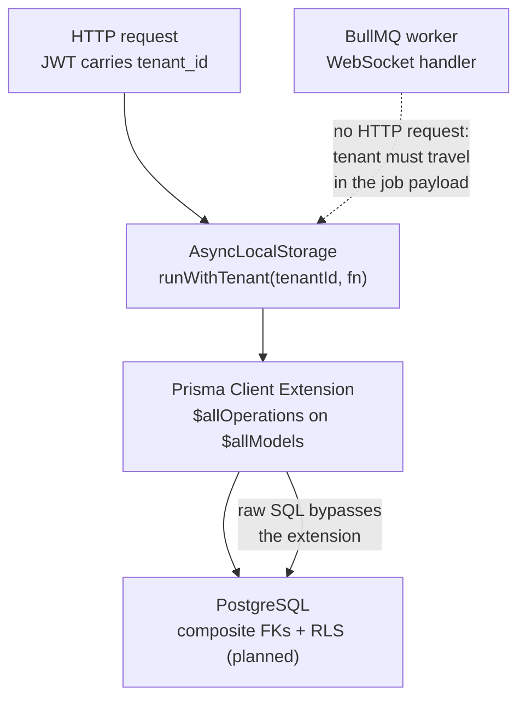
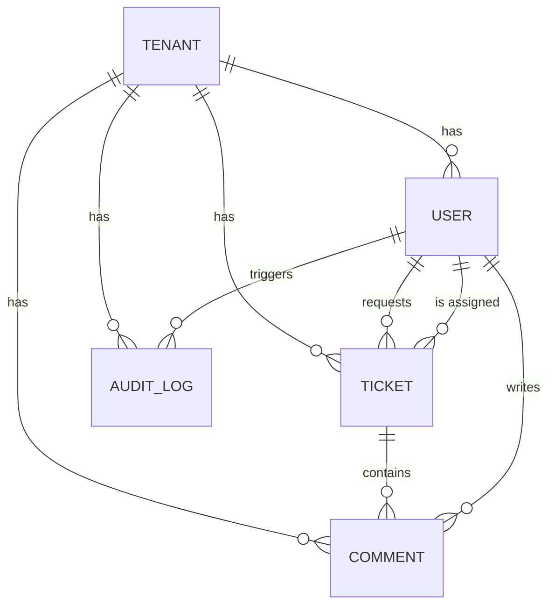

<h1 align="center">NexusOps — Backend</h1>

<p align="center">
  <strong>A B2B multi-tenant SaaS backend for corporate automation and helpdesk.</strong><br>
  Built to solve senior-level engineering problems — tenant isolation, concurrency,
  auditability, async work — not just to ship CRUD.
</p>

<p align="center">
  <a href="https://github.com/brunocbarbosa/NexusOps_backend/actions/workflows/ci.yml"></a>
  <a href="https://github.com/brunocbarbosa/NexusOps_backend/actions/workflows/codeql.yml"></a>
  <a href="https://sonarcloud.io/summary/new_code?id=brunocbarbosa_NexusOps_backend"></a>
  <a href="./LICENSE"></a>
</p>

<p align="center">
  
  
  
  
  
  
</p>

---

## Why this project exists

Most portfolio backends demonstrate that the author can wire a controller to a database. This one
is built around a different question: **what happens when the thing you must never get wrong
depends on a developer remembering to do something?**

The answer applied throughout this codebase is that it must not depend on memory. Every
cross-cutting guarantee here is implemented as a **chokepoint** — a single place the code must pass
through — rather than as a convention repeated in every handler. A tenant filter you have to write
by hand is a tenant filter that will eventually be forgotten, and in a multi-tenant SaaS that is a
data breach, not a bug.

That principle is what the code below is actually about.

---

## Project status

This is an in-progress portfolio project, and the README says exactly where it stands.

| Area                                   | Status         | Notes                                                                        |
| -------------------------------------- | -------------- | ---------------------------------------------------------------------------- |
| Tenant isolation (`src/tenancy/`)      | ✅ Implemented | Prisma Client Extension + `AsyncLocalStorage`, covered by 19 isolation tests |
| Data model & migrations                | ✅ Implemented | 5 models, composite foreign keys, tenant-leading indexes                     |
| Three-tier test infrastructure         | ✅ Implemented | unit / integration / e2e, with an ephemeral Postgres + Redis stack           |
| CI/CD pipeline                         | ✅ Implemented | 7 jobs, branch rulesets, CodeQL, SonarCloud gate, GHCR image                 |
| Production Docker image                | ✅ Implemented | Multi-stage, non-root, pruned 778 MB → 406 MB, smoke-tested against a DB     |
| Row-Level Security (defense in depth)  | 🔬 Researched  | Behaviour measured and documented; policies and app role not written yet     |
| Auth (JWT + RBAC), domain modules      | 🚧 Planned     | Dependencies wired; `src/` beyond tenancy is still the NestJS scaffold       |
| Audit trail, BullMQ queues, WebSockets | 🚧 Planned     | Designed and modelled in the schema; modules not written yet                 |

---

## Architecture

Five problems drive the design. Each one has a designated mechanism, and each mechanism is a
chokepoint rather than a per-handler convention.

### 1. Multi-tenancy — shared database, shared schema

Isolation is enforced in **three deliberately redundant layers**, so that a failure in any one of
them is not by itself a leak.



**Layer 1 — request-scoped identity.** `AsyncLocalStorage` (from `node:async_hooks`, no library)
holds the authenticated user's tenant for the lifetime of the request.

The API is deliberately hostile to bypasses. There is no `currentTenantId(): string | undefined`,
because `currentTenantId() ?? fallback` is precisely the silent failure this design exists to
prevent. What exists instead:

```ts
requireTenantId(); // string, or throws TenantContextMissingError — never nullable
runWithTenant(id, fn); // establishes the scope; always async, because PrismaPromise is lazy
runWithoutTenant(fn); // the explicit, greppable escape hatch — used by the login path only
```

**Layer 2 — the Prisma extension.** [`src/tenancy/tenant-extension.ts`](src/tenancy/tenant-extension.ts)
hooks `$allOperations` on `$allModels`, so "I forgot to scope this query" is not a reachable
state. It classifies every operation and **fails closed**: an operation nobody classified — a new
one introduced by a Prisma upgrade, say — is refused rather than run unfiltered. It also rejects
writes that try to move a row across tenants, instead of silently overwriting them.

**Layer 3 — the database.** Two measured limits of the extension are closed in the schema rather
than papered over: nested writes and `include` are not intercepted by the query hook, so every
child relation uses a **composite foreign key** against `@@unique([tenantId, id])` on its parent.
Postgres itself then rejects a cross-tenant reference, and `tenantId` disappears from the nested
write input — making the wrong tenant _inexpressible_ through the API rather than merely
disallowed. Row-Level Security is the planned backstop for raw SQL, which never reaches the
extension at all.

> **The single most likely place for a tenant leak** is that **BullMQ workers and WebSocket
> handlers have no HTTP request**, so the `AsyncLocalStorage` context is empty there. Tenant
> identity must be carried explicitly in the job payload and re-established with `runWithTenant`
> before any query runs. The integration suite has a dedicated `background worker` block asserting
> exactly this.

The extension's measured behaviour against Prisma 7.9.1 — five findings the design depends on — is
written up in [`documents/important/TENANCY_EXTENSION.md`](documents/important/TENANCY_EXTENSION.md).

### 2. Optimistic concurrency control

Two agents updating the same ticket is a real race in a helpdesk, not a hypothetical. Mutable rows
carry a `version` column, and the safe update is `updateMany({ where: { id, tenantId, version } })`
rather than `update()` — because `update` requires a unique `where`, and `{ id, version }` is not
unique. A returned `count === 0` means someone else already changed the row, and the request fails
loudly with `409 Conflict` instead of silently overwriting the other person's work.

### 3. Reactive audit trail

`@nestjs/event-emitter` implements the Observer pattern: mutations emit events, and the audit
module listens and persists rows as `JSONB`. Business logic never calls the audit service directly
— removing exactly that coupling is the point of the design.

### 4. Asynchronous processing

Anything that would block the Node event loop (report generation, file processing) goes to a
**BullMQ** queue on Redis instead of running inside the request. Redis is configured with
`maxmemory-policy noeviction`, because evicting a BullMQ key mid-flight corrupts the queue.

### 5. Real-time notifications

A NestJS WebSockets Gateway (socket.io) notifies the client when a background job finishes — which
is why Redis serves double duty here: queue backend and permission cache.

---

## Data model

Five models, all tenant-scoped except `Tenant` itself, which _is_ the tenant.



Three schema decisions are load-bearing rather than cosmetic:

- **`@@unique([tenantId, id])` on every scoped model.** It gives the extension a guaranteed path to
  scope `findUnique`, it is the target of the child tables' composite foreign keys, and it doubles
  as the `tenant_id`-leading index — so a separate `@@index([tenantId])` would be redundant.
- **Indexes lead with `tenant_id`.** Every query in a multi-tenant system is tenant-scoped; an
  index that does not lead with `tenant_id` never enters the query plan.
- **`onDelete: Restrict` on `assignee` and on `AuditLog.user`.** Nulling one column of a composite
  key is impossible while `tenantId` is `NOT NULL`, and an audit trail that vanishes with the user
  is not an audit trail. The accepted consequence is that user deletion must anonymize first — and
  forgetting to do so fails loudly.

---

## Testing

Three tiers, separated by **what each one is allowed to touch**. The payoff is diagnostic: a
failure tells you where to look before you open a single file.

| Tier            | Command             | Reaches                        | Needs Docker |
| --------------- | ------------------- | ------------------------------ | ------------ |
| **unit**        | `npm run test:unit` | nothing — mocks only           | no           |
| **integration** | `npm run test:int`  | a real PostgreSQL, no HTTP     | yes          |
| **e2e**         | `npm run test:e2e`  | HTTP against a booted Nest app | yes          |

The DB-backed tiers run against an **ephemeral stack** (`docker-compose.test.yml`: Postgres on
5433, Redis on 6380, data directory on `tmpfs`) that starts empty and dies with the container. The
suites truncate and reseed, so they must never point at your development database — the
`DOTENV_CONFIG_PATH=.env.test` in the npm scripts is what keeps them off it.

Two suites are the ones worth reading:

- [`test/integration/tenant-isolation.int-spec.ts`](test/integration/tenant-isolation.int-spec.ts)
  — 19 cases holding the chokepoint design in place: schema-layer isolation, extension behaviour,
  the background-worker context gap, and the tenant-agnostic `Tenant` model.
- [`test/integration/prisma-wiring.int-spec.ts`](test/integration/prisma-wiring.int-spec.ts)
  — the regression guard for the three Prisma 7 wiring requirements (driver adapter, CJS output,
  VM modules).

`src/app.setup.ts` is the second chokepoint in the repository, for the same reason as the first:
it holds everything that turns a bare Nest app into _this_ app. Both `main.ts` and the e2e test
factory call it, so an e2e assertion can never be exercising a differently-configured application
than the one that ships.

---

## CI/CD

Seven jobs on every pull request. Several exist because a specific failure mode was observed, not
because a template suggested them.

| Job                 | Guards against                                                                             |
| ------------------- | ------------------------------------------------------------------------------------------ |
| `guard-main-source` | A PR into `main` from anywhere but `development` — rulesets can't restrict the head branch |
| `commitlint`        | Commit messages that `git commit --no-verify` slipped past the local hook                  |
| `quality`           | ESLint (read-only), Prettier `--check`, `tsc --noEmit`                                     |
| `test`              | All three tiers against the same compose file you run locally; uploads coverage            |
| `audit`             | `npm audit --audit-level=high`                                                             |
| `sonar`             | SonarCloud quality gate on **new** code: 80% coverage, 3% duplication                      |
| `docker`            | Builds, **boots and curls** the image, then runs a Prisma smoke test against a live DB     |

Plus **CodeQL** on every PR, push, and weekly; **Dependabot** for npm and Actions; and **secret
scanning with push protection**.

The `docker` job is the interesting one. `tsc`'s incremental cache once survived a `deleteOutDir`,
which made a clean build emit **zero files and exit 0** — and `COPY` of an empty `dist/` raises no
error either. Only actually booting the image catches that. The subsequent Prisma smoke test
(`$queryRaw` plus a model query) is what keeps the Dockerfile's aggressive prune honest: the pruned
packages load lazily, so a wrong prune surfaces on the first real query, never at boot.

**Branch flow:** `development` is the default branch and receives all work; `main` receives only
from `development`. Both require a pull request with green checks, and there are no bypass actors —
a direct push is rejected for admins too.

---

## Getting started

**Requirements:** Node.js 24, Docker with Compose, npm.

```bash
git clone https://github.com/brunocbarbosa/NexusOps_backend.git
cd NexusOps_backend
npm install

cp .env.example .env         # adjust credentials if you like; the defaults work as-is
npm run infra:up             # PostgreSQL + Redis via docker compose
npm run prisma:generate      # required — the client is generated into a gitignored folder
npm run prisma:migrate       # apply migrations
npm run start:dev            # http://localhost:3000
```

Run the test suites:

```bash
npm run test:unit            # no Docker required
npm run test:setup           # ephemeral Postgres on 5433 + migrations
npm run test:int
npm run test:e2e
npm run infra:test:down      # tear the ephemeral stack down
```

Build and run the production image:

```bash
npm run docker:build
docker run --rm -p 3000:3000 --env-file .env nexusops-backend:local
```

---

## Command reference

<details>
<summary><strong>All npm scripts</strong></summary>

```bash
# Infrastructure
npm run infra:up            # start PostgreSQL + Redis (detached)
npm run infra:down          # stop containers
npm run infra:reset         # destroy volumes and recreate (wipes local data)
npm run infra:logs          # tail container logs
npm run infra:test:up       # start the ephemeral test stack (ports 5433/6380)
npm run infra:test:down     # stop it and destroy its volumes
npm run test:setup          # infra:test:up + migrate deploy against .env.test

# Application
npm run start:dev           # dev server, watch mode
npm run build               # nest build -> dist/
npm run start:prod          # node dist/main
npm run docker:build        # build the production image locally

# Quality
npm run lint                # eslint --fix (rewrites files)
npm run format              # prettier --write
npm run format:check        # read-only; this is what CI runs

# Tests
npm test                    # alias for test:unit
npm run test:unit           # tier 1 — mocks only
npm run test:int            # tier 2 — real Postgres
npm run test:e2e            # tier 3 — HTTP against a booted app
npm run test:all            # the three in order
npm run test:cov            # coverage for the unit tier

# Prisma
npm run prisma:generate     # regenerate the client into src/generated/prisma
npm run prisma:migrate      # migrate dev
npm run prisma:deploy       # migrate deploy (CI/production)
npm run prisma:reset        # drop and rebuild from migrations
npm run prisma:studio
```

</details>

<details>
<summary><strong>Prisma 7 notes (three things that must all be right)</strong></summary>

Prisma 7 is a sharp break from v6, and this repo depends on all three of these:

1. **A driver adapter is mandatory.** `new PrismaClient()` with no arguments is a _compile-time_
   error; the client is constructed with `PrismaPg` from `@prisma/adapter-pg`. Pool settings now
   come from `pg`, not from Prisma.
2. **The generator must emit CommonJS.** NestJS compiles to CJS, so the schema sets
   `moduleFormat = "cjs"` and `importFileExtension = ""`. Prisma 7 generates TypeScript _source_,
   not compiled JS — which is why the extension setting matters at all.
3. **Jest needs `--experimental-vm-modules`.** The Prisma runtime uses dynamic `import()`, which
   Jest's default CJS VM rejects, so the DB-backed tiers run through `node` rather than the `jest`
   binary.

Also: Prisma 7 does **not** read `.env` on its own. `prisma.config.ts` imports `dotenv/config`, and
that is the only reason the CLI sees `DATABASE_URL` — which is why the datasource block has no
`url`.

</details>

---

## Project layout

```
src/
  tenancy/                  # the load-bearing part: AsyncLocalStorage context + Prisma extension
  app.setup.ts              # configuration chokepoint, shared by main.ts and the e2e suite
  generated/prisma/         # gitignored — run prisma:generate after cloning
prisma/
  schema.prisma             # 5 models, composite FKs, tenant-leading indexes
  migrations/
test/
  integration/              # tier 2 — real Postgres, no HTTP
  e2e/                      # tier 3 — Supertest against a booted app
  jest.base.js              # shared rootDir, so the three tiers' lcov paths stay comparable
scripts/
  docker-smoke.js           # runs inside the image, against a live DB
documents/                  # project documentation (Portuguese)
```

---

## Documentation

Project documentation is written in Portuguese; the code and its comments are in English.

| Document                                                                               | What it covers                                                      |
| -------------------------------------------------------------------------------------- | ------------------------------------------------------------------- |
| [`documents/MAIN.md`](documents/MAIN.md)                                               | The authoritative specification — the "why" behind each technology  |
| [`documents/important/TENANCY_EXTENSION.md`](documents/important/TENANCY_EXTENSION.md) | Measured Prisma 7.9.1 behaviour the tenant extension depends on     |
| [`documents/important/RLS_NOTES.md`](documents/important/RLS_NOTES.md)                 | Row-Level Security research, including two traps measured firsthand |
| [`documents/CHECKLIST_TESTS_CICD.md`](documents/CHECKLIST_TESTS_CICD.md)               | What is done and what is still pending, item by item                |
| [`documents/study/GUIA_CI_CD.md`](documents/study/GUIA_CI_CD.md)                       | The CI/CD setup explained from first principles                     |
| [`CLAUDE.md`](CLAUDE.md)                                                               | Working agreements and traps, for both humans and AI agents         |

---

## Roadmap

- [ ] Auth module — JWT with the tenant in the payload, Passport, bcrypt, RBAC
- [ ] Row-Level Security — policies, a low-privilege application role, and `set_config` inside an
      interactive transaction (setting the tenant outside one lands on a different pooled
      connection than the query, which under concurrency serves another tenant's rows)
- [ ] Ticket module with optimistic concurrency enforced end to end
- [ ] Audit module listening on domain events
- [ ] BullMQ queues and workers, with tenant context re-established from the job payload
- [ ] WebSockets gateway for job-completion notifications
- [ ] Merged coverage across the three tiers, plus a Jest `coverageThreshold`
- [ ] Deploy job consuming the image from GHCR

---

## License

[MIT](./LICENSE) © Bruno Barbosa
